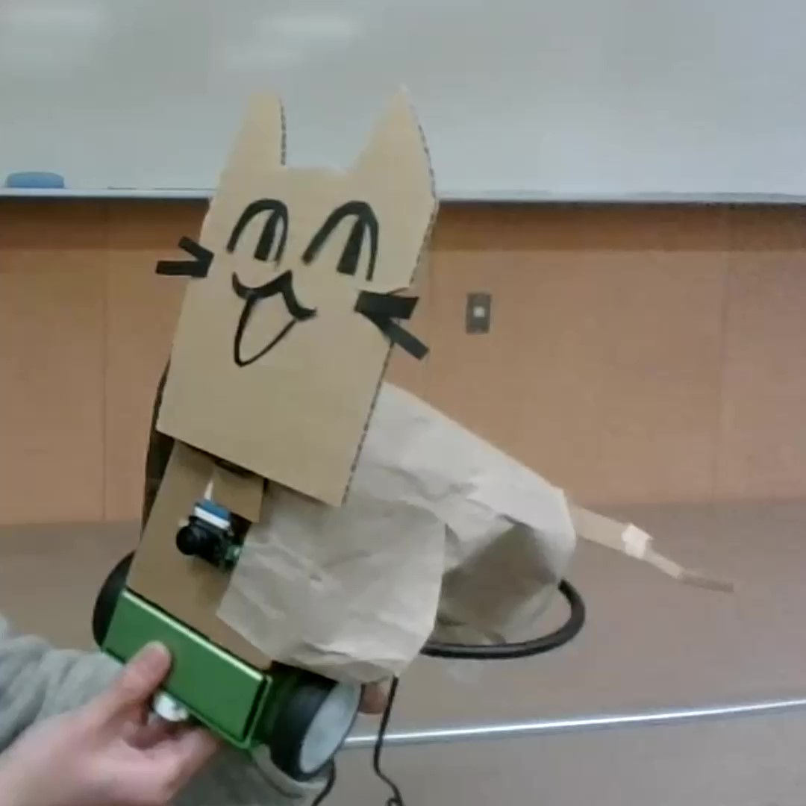

# Gijineko-chan

'Gijineko-chan' is a cat robot to check whether you are suitable as a pet owner.<br>
Its capricious personality will toy with you, but surely you are not the kind of person to get irritated with a cat, are you?

## Background

News of animal abuse by pet owners is unending. We've thought it would be beneficial if there was a way to verify whether a person can responsibly care for a pet without using a real animal, before they decide to buy or adopt one.<br>
Our ultimate goal is to create a robot that replicates all the frustrating behaviors exhibited by pet animals, to assess human responses. As part of this endeavor, we've attempted to recreate the cats' whimsical and capricious nature.


*Our work*

## Table of Contents

1. [Requirements](#Requirements)
2. [Advance Preparation](#Advance-Preparation)
3. [Setup](#Setup)
4. [Usage](#Usage)
5. [Customize Model](#Customize-Model)
6. [Future Direction](#Future-Direction)
7. [References](#References)

## Requirements

* Software
  * JetPack 4.6
  * Some WAV-format audion data of cat voice

* Hardware
  * JetBot 2GB AI Kit
  * SG-90 servo motor
  * KKHMF PCA9685 servo motor driver
  * Audio equipment
  > ***Note:***<br>
      *Jetson Nano does not have an audio output port.
      If you do not have a good solution for this problem, you might consider prepairing the following.*
    * HDMI audio extractor
    * 3.5mm female to 2 RCA male conversion cable
    * Earphone jack mini speaker

## Advance Preparation

Before starting this project, please follow the information below to set up.

* [Hardware Setup](https://jetbot.org/master/hardware_setup.html)
* [Software Setup](https://jetbot.org/master/software_setup/sd_card.html)
  * Download JetPack [Version 4.6](https://developer.nvidia.com/jetpack-sdk-464)

## Setup
### Step 1 - Prepair Servo Motor Driver

1. Perform the following operations in the JetBot's JupiterLab terminal.

    ```bash
    pip3 install Jetson.GPIO
    pip3 install Adafruit_PCA9685 --user
    ```

2. Connect the motor driver to the pins on the JetBot and Jetson Nano.

    * moter driver v+ -> jetbot 5v
    * moter driver vcc -> nano pin17
    * moter driver SDA -> nano pin27
    * moter driver SCL -> nano pin28
    * moter driver GND -> nano pinGND
    * moter driver OE -> nothing

3. Log in to the JetBot using SSH, and perform the following operations.

    ```bash
    sudo i2cdetect -y -r 0
    ```

    If you see the following text, the motor driver setup is complete!

    ```
        0   1   2   3   4   5   6   7   8   9   a   b   c   d   e   f
    00:             --  --  --  --  --  --  --  --  --  --  --  --  --
    10: --  --  --  --  --  --  --  --  --  --  --  --  --  --  --  --
    20: --  --  --  --  --  --  --  --  --  --  --  --  --  --  --  --
    30: --  --  --  --  --  --  --  --  --  --  --  --  --  --  --  --
    40: 40  --  --  --  --  --  --  --  --  --  --  --  --  --  --  --
    50: --  --  --  --  --  --  --  --  --  --  --  --  --  --  --  --
    60: --  --  --  --  --  --  --  --  --  --  --  --  --  --  --  --
    70: 70  --  --  --  --  --  --  --
    ```
    ***Note:*** It is okay if '70' is not displayed.

### Step 2 - Prepair Audio

1. Perform the following operations in the JetBot's JupiterLab terminal.

    ```bash
    apt-get install portaudio19-dev
    pip3 install pyaudio==0.2.14
    apt-get install alsa
    adduser root audio
    ```

### Step 3 - Install this project and setting

1. Log in to the JetBot using SSH, and perform the following operations.

    ```bash
    git clone https://github.com/3279mitsunaka/Gijineko-chan.git
    ```

2. Move the WAV-format audion data of cat voice to the 'voice' folder.

3. Replace the appropriate values in the code, such as the filename of the audio and the pin for the servo motor.

4. Dress up the robot's appearance as you like! :)


## Usage

Follow the instructions provided in ['main.ipynb'](main.ipynb) to run Jetbot, and enjoy whimsical object tracking.

By default, the following three modes automatically switch every few dozen seconds.
1. Chasing a stuffed cat while threatening.
2. Pursuing Churu while engaging in persistent flattery.
3. Quietly showing interest in the stuffed sea urchin and chasing it.

## Customize Model
Our dataset has bias. If the robot doesn't work satisfactorily, you should create new datasets and retrain models.

This robot is developed using [the provided sample code](https://github.com/NVIDIA-AI-IOT/jetbot/tree/master/notebooks/road_following).<br>
Please refer to it for creating datasets and training models.

1. Follow the instructions provided in either ['data_collection.ipynb'](https://github.com/NVIDIA-AI-IOT/jetbot/blob/master/notebooks/road_following/data_collection.ipynb) or ['data_collection_gamepad.ipynb'](https://github.com/NVIDIA-AI-IOT/jetbot/blob/master/notebooks/road_following/data_collection_gamepad.ipynb) to collect photos for each object.<br>
Afterward, create zip files for them.

2. Follow the instructions provided in ['train_model.ipynb'](https://github.com/NVIDIA-AI-IOT/jetbot/blob/master/notebooks/road_following/train_model.ipynb) to train models.

3. Follow the instructions provided in ['live_demo_build_trt.ipynb'](https://github.com/NVIDIA-AI-IOT/jetbot/blob/master/notebooks/road_following/live_demo_build_trt.ipynb) to build TensorRT models.

4. Open ['gijinekochan/main.ipynb'](main.ipynb) to move JetBot with the TensorRT optimized models.<br>
Don't forget to rewrite the code to match the model name.

## Future Direction
Each model was trained using hundreds of photos, which results in less than optimal accuracy. Furthermore, the current implementation of audio within the code presents flaws, leading to decreased object tracking accuracy over time. We are planning to address these issues in future updates.<br>
In summary, while there are still some issues, it can be said that they suggest promising potential for the development of a robot designed to assess the suitability of individuals as pet owners.

## References
[NVIDIA-AI-IOT/jetbot](https://github.com/NVIDIA-AI-IOT/jetbot)<br>
[Jetson AI Courses and Certification (JA-JP)](https://developer.nvidia.com/ja-jp/embedded/learn/jetson-ai-certification-programs)<br>
[Jetbot](https://jetbot.org/master/index.html)<br>
